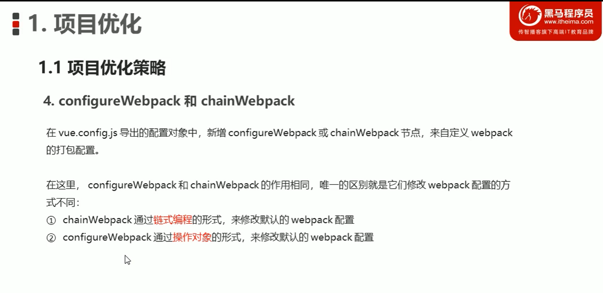

- 怎么配置GitHub
1. git config --global user.name "guessfinger"
   git config --global user.email "373898092@qq.com"
2. git config --list  // 查看已经配置的列表
3. ssh-keygen -t rsa -C "373898092@qq.com"
4. 把其中生成的公钥(也就是有pub后缀的) 添加到GitHub上的token里面
5. ssh -T git@github.com  只要出现类似下面的语句就表示成功了
    'Hi xiangshuo1992! You've successfully authenticated, but GitHub does not provide shell access.'


- 构建vue项目
1. 命令行 vue ui  会打开浏览器，我们在浏览器中创建项目
2. 选择自定义安装 勾选babel router 等等   然后安装 vue-cli-plugin-element  axios
3. 把项目上传到你GitHub上的项目里面 (一般新创建的项目它会有提示你怎么处理的)
   

- 如果存在跨域的问题 可以使用token来解决这个问题


- 安装scss的时候报错了，可以根据错误信息去百度一下 看一看报错的内容是什么  主要就是因为安装的版本太高了 按照网络上的卸载然后从新安装
- 导入element-ui的时候报错 一直引入进来  使用vue-ui安装的时候 没有成功 最直接的表现就是 没有plugin/element.js的文件 
    重新安装以后 在main.js中 按需进行导入  import {Button} from 'element-ui'  Vue.use(Button) 这样的话 就可以使用element
    的组件了
- 在routers中配置的路由信息  当访问根目录的时候 {path:'/',redirect:'/login'}  
    当腰配置一个路由的时候 {path:'/login',component:login(这里的话 可以采用 () => import xxx  这种方式)}
    配置完路由以后 需要使用  router-view 这样路由组件就会在 app.vue中进行显示了
- 针对不同的浏览器 市面上有一套通用的处理css的方式  https://github.com/necolas/normalize.css  就是为了兼容不同的浏览器
- 针对某个特定的组件 给它的css中添加scoped 表示这个样式只针对当前的组件是生效
---
2021年6月30日22:33:12 lesson30章节
- form表单的验证 
    - 之前用过 在公司的时候用的是xui的组件 死活不生效，很苦恼 不知道因为什么？ 今天在login组件中也出现同样的情况 
    最后发现是你loginForm:{userName:''} 和 formRules:{userName:''}  里面的属性名必须一致 至于名称的大小写是没有关系的
    主要就是里面**属性名称一定要保持一致**
    - 把表单中的内容进行情况  this.$refs.loginForm.resetFields()直接调用这个方法就可以了
    - 提交之前我们需要对表单进行预校验  this.$refs.loginForm.validate(value => {}) 其中可以判断value的值 如果true表示验证通过
- 错误提示框  之前在使用el-button的时候 采用的是 import {Button} from 'element-ui' Vue.use(Button)  
    但是错误提示框不一样 import {Message} from 'element-ui';Vue.prototype.$message = Message 这样的使用方法
- axios  
    - import axios from 'axios' 使用axios的时候  **不需要用Vue.use(axios)** 
    - 把axios绑定在$http上 Vue.prototype.$http = axios
    - 把默认的访问路径可以设置下 axios.defaults.baseURL = "https://www.baidu.com/api/vi/"
    - 老师把异步方法用async  await 这样的方法进行访问  
- router
    - 登录成功后需要进行路由跳转  this.$router.push("/home") 这样的方式 配置路由的方式和之前一致 
        {path:'/home',component:home}  
    - 路由的巡航守卫，从下面的代码可以看出来  next(里面添加路径就是下一个需要访问的路径) 这个是访问之前进行的设置 还有一个是访问
        进行的设置 afterEach()
    ```JavaScript
      router.beforeEach((to,from,next) => {
          // from 从哪里来 to  到哪里去  这个一定要执行next()方法 要不然不知道往哪里访问了
          if (to.path === '/login') {
              return next()
            }
            const tokenStr = window.sessionStorage.getItem('token')
            if (!tokenStr) return next('/login')
            next() 
      })
    ```
- prettierrc 这个文件主要是配置格式化代码用的 已经有了.eslintrc文件 这个感觉也不是很必要   
---
- 2021年7月1日23:59:27  lesson44

- 给axios添加拦截器
  ```javascript
      axios.interceptors.request.use(config => {
        // 这样可以给每个request都添加相关的信息 项目这里给每个都添加一个token
        // 通过打印config 可以查看到其中的关键信息 需要注意的是 一定要返回config  这个和router里面的beforeEach 里面
        // 一定要返回next()是一样的 
        console.log(config)    
        return config;
      })
  ```
- 给路由添加子路由信息
    `router:[{path:'/home',redirect:'/welcome',component:home,children:[{path:'/welcome',component:welcome}]}]`
- 老师在mounted中调用的方式是 使用的是下面的那种方式 实际在项目中 我们也可以采用 
    ```javascript
        new Vue({
            mounted(){
                this.menuList();
            }, 
            methods:{
              async menuList(){
                let {data:res} = await this.$http.get('/menus');
                
              }
            }
      }) 
    ```
---
- 2021年7月3日00:16:42 lesson58

- axios发送get请求 `this.$http.get('users',{params:{query:'',pageNum:1,pageSize:5}})`  刚看调了半天以为是接口的问题 
    最后发现是发现是写错了 get 参数编写 {params:{'参数对象':'参数对象'}} 这样的写法 和post不一样哈

- element-ui中form表单的自定义验证规则
   ```javascript
    let checkEmail = (rule,value,cb) => {
        // value 表示需要验证的值 cb 表示回调函数 如果是错误的话 需要往里面传入一个错误对象 
        const regEmail = /^([a-zA-Z0-9_-])+@([a-zA-Z0-9_-])+(\.[a-zA-Z0-9_-])+/
        if (regEmail.test(value)) {
          return cb()
        }
        cb(new Error('请输入正确的邮箱')) 
    }
    // 使用这个规则的话 用validator 然后对象指向你自定义的规则就可以了  
    let ruleObj = {email: [
          {required: true, message: '请输入邮箱',trigger: 'blur'},
          { min: 5, max: 20, message: '长度在 5 到 20 个字符', trigger: 'blur'},
          { validator: checkEmail,trigger: 'blur'}]};
   ```

- element-ui组件 
    - 比如说 el-input disable的 如果直接写disable的没有任何问题 另一种写法 :disable="false"  注意前面的:
    - 在使用导航栏的时候 router 可以用index作为路由  default-active 激活当前菜单的index 
    - 在使用el-pagination的时候 其中有一个属性:current-page="pageNum " 注意pageNum最后面有空格是不行的  
    - 在使用el-tabs的时候 页面直接卡死了 以为是哪里写错了 需要把el-tabs放到el-row里面就好了
- 页面数组渲染的时候  如果往数组里面添加一个元素的时候  页面中的数组可能没有数组刷新 用VUe.$set(array,index,value) 这样的方式就可以重新刷新页面

- 全局过滤器
```javascript
   Vue.filter('dateFilter',(value) => {
    const date = new Date(value)
    const year = date.getFullYear()
    const month = (date.getMonth() + 1 + '').padStart(2, '0')
    const day = (date.getDate() + '').padStart(2, '0')
    const hour = (date.getHours() + '').padStart(2, '0')
    const minutes = (date.getMinutes() + '').padStart(2, '0')
    const seconds = (date.getSeconds() + '').padStart(2, '0')
    return `${year}-${month}-${day} ${hour}:${minutes}:${seconds}` 
   })
   // 1. 全局过滤器的用 Vue.filter(filterName,() => {}) 这样的方式定义的
   // 2. 之前针对月啊 小时啊  都是判断是否小于10  然后手动的去拼接0  es6是有语法的 padStart(length,str) 下次遇到的话这样处理
   // 3. 字符串模板也要用起来  `${year}-${month}-${day]` 
```

- 在添加步骤条的时候 样式怎么都对不上 哎 找了半天都没有发现问题 最后返现在 #app上添加了一个全局属性 text-align:center 
    导致后面的样式一直有问题的 在添加全局样式的时候 一样要非常的小心 你影响的是全局的组件
    
- `import TreeTable from 'vue-table-with-tree-grid'` 这个是树形表格
  `import VueQuillEditor from 'vue-quill-editor'`  富文本编辑器
  `@import "../../plugins/timeline/timeline.css";`  在组件的style中可以这样引用css
  `import * as echarts from 'echarts'` 导入echarts的时候 因为它默认导出的是* 所以我们要这样重命名下 
- 如果一个组件没有办法使用的时候 注意一下版本问题 

- 项目优化的策略
    - 生成打包报告
    - 启动第三方的CDN
    - element-ui组件的按需加载
    - 路由的懒加载
    - 首页内容的定制


- 项目优化 
    
    ```
        // - 安装 NProgress插件(运行依赖)
        // 这个插件的作用就是 在进行菜单切换的时候 最上面有一个进度条 
        import "NProgress" from "nprogress"
        import 'nprogress/nprogress.css'
        // axios.interceptors.request 中添加 NProgress.start()
        // axios.interceptors.response 中添加 NProgress.done()
        
        // babel-plugin-transform-remove-console 这个插件的作用就是 防止我们在生产打包的时候 把console.log也打包进去
        // 在babel.config.js中的plugins:['transform-remove-console'] 这样我们重新打包就可以了
        // 这里面有一个问题 就是我在开发阶段我是不需要移除console.log的
        const prodPlugins = [];
        if(process.env.NODE_ENV === 'production'){
            prodPlugins.push('transform-remove-console')
        }    
        // 在下面的对象中
        plugins:[['这里是另一些配置插件'],...prodPlugins]
  
    ```
  
    - 生成打包报告
        - 通过命令行的方式 `vue-cli-service build --report`
        - 直接通过ui可视化面板中进行查看 在分析中 (发现有一个文件非常的大？ 它把所有第三方引入的包js和css，都打包进入同一个文件中了，
        怎么处理呢？如果可以访问外网的话 我们可以把第三方的包 用CDN的方式进行引入)
            ```
                // 在vue.conf.js中的打包依赖中配置  这个的意思就是 如果打包遇到下面这些包的话 不要把它打包进去 
                config.set('externals', {
                      vue: 'Vue',
                      'vue-router': 'VueRouter',
                      axios: 'axios',
                      lodash: '_',
                      echarts: 'echarts',
                      nprogress: 'NProgress',
                      'vue-quill-editor': 'VueQuillEditor'
                })  
                // 接着在index.html文件中 把你排除在外的js和css引进去
                <link rel="stylesheet" href="https://cdn.staticfile.org/nprogress/0.2.0/nprogress.min.css" />
                <!-- 富文本编辑器 的样式表文件 -->
                <link rel="stylesheet" href="https://cdn.staticfile.org/quill/1.3.4/quill.core.min.css" />
                <link rel="stylesheet" href="https://cdn.staticfile.org/quill/1.3.4/quill.snow.min.css" />
                <link rel="stylesheet" href="https://cdn.staticfile.org/quill/1.3.4/quill.bubble.min.css" />
                <!-- element-ui 的样式表文件 -->
                <link rel="stylesheet" href="https://cdn.staticfile.org/element-ui/2.8.2/theme-chalk/index.css" />
                <script src="https://cdn.staticfile.org/vue/2.5.22/vue.min.js"></script>
                <script src="https://cdn.staticfile.org/vue-router/3.0.1/vue-router.min.js"></script>
                <script src="https://cdn.staticfile.org/axios/0.18.0/axios.min.js"></script>
                <script src="https://cdn.staticfile.org/lodash.js/4.17.11/lodash.min.js"></script>
                <script src="https://cdn.staticfile.org/echarts/4.1.0/echarts.min.js"></script>
                <script src="https://cdn.staticfile.org/nprogress/0.2.0/nprogress.min.js"></script>
                <!-- 富文本编辑器的 js 文件 -->
                <script src="https://cdn.staticfile.org/quill/1.3.4/quill.min.js"></script>
                <script src="https://cdn.jsdelivr.net/npm/vue-quill-editor@3.0.4/dist/vue-quill-editor.js"></script>
                <!-- element-ui 的 js 文件 -->
                <script src="https://cdn.staticfile.org/element-ui/2.8.2/index.js"></script>
           ```
    
    - vue.config.js  vue-cli 让程序员更加关注业务逻辑的处理 如果我们要改变webpack的配置 在项目的根目录下创建vue.config.js文件 
        
        configureWebpack和chainWebpack的作用都是一样的 自定义webpack的定义方法 后面的是通过链式的方式进行修改 前面的是通过对象
        更加详细的可以查看上面的图片
        
    - 路由的懒加载
    ```
      - 安装插件 @babel/plugin-syntax-dynamic-import
      - 在babel.config.js中进行配置  也就是引入上面的插件
      - 使用 () => import(...) 这种配置方式 中间的配置是把你规定的文件打包到同一个文件中 也就是分组的概念
  
      // import list from '../components/goods/list'
      const list = () => import(/* webpackChunkName: "GoodsList_Add" */ '../components/goods/list.vue')
      // import add from '../components/goods/add'
      const add = () => import(/* webpackChunkName: "GoodsList_Add" */ '../components/goods/add.vue')
      
      // import orders from '../components/order/order'
      const orders = () => import(/* webpackChunkName: "Order_Report" */ '../components/order/order.vue')
      // import report from '../components/report/report'
      const report = () => import(/* webpackChunkName: "Order_Report" */ '../components/report/report.vue')
    ```
          
        
- 讲道理 照着这个项目敲了一下代码 在实际的开发中是有很大帮助的 加油
